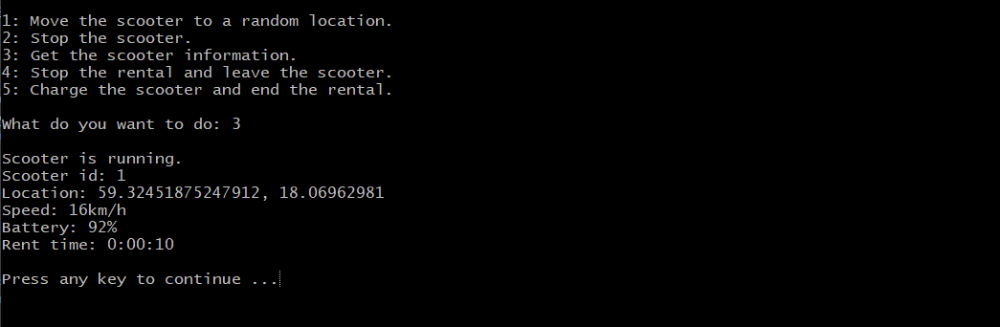

[](https://dl.circleci.com/status-badge/redirect/gh/Rahn20/spark-program/tree/main)
[](https://scrutinizer-ci.com/g/Rahn20/spark-program/?branch=main)
[](https://scrutinizer-ci.com/g/Rahn20/spark-program/?branch=main)
[](https://scrutinizer-ci.com/g/Rahn20/spark-program/build-status/main)
[](https://github.com/PyCQA/pylint)


# Scooter program

This repository is part of a group project in program development in virtual team course (vteam) at [Blekinge Institute of Technology](https://www.bth.se/). The group project consists of several parts, and this is one of them, which we call **The intelligence of the scooter**. 


  


## Setup

There are two ways to get the system running: either you start all components (backend, frontend (admin), mobile app, webclient customer and scooter program) locally, or you use the dockerized version.

## Run with Docker

Your system must have [Docker](https://www.docker.com/get-started/) enabled.

You can run the beta version of the scooter program which is not connected to the API or database. And it is the user mode.

```
docker run -it ranim04/spark-program:beta
```

You can run the main or simulation program connected to the API, but you need to run the backend before running this program. This program is a part of a large system. You can find all subsystems along with ***docker-compose.yml*** in this [repository](https://github.com/sumca252/spark).

```
# User mode
docker-compose run spark-program

# Simulation
docker-compose run spark-simulation
```

### Build and run docker image

Path /spark-program

```
docker build -t scooter-program .
docker run --rm -it scooter-program
```

## Local

### Installation

To run the scooter program locally, you need [Python](https://www.python.org/downloads/), [Pip](https://pypi.org/project/pip/) and **venv** installed on your machine. You can install **venv** by running:

1. For Cygwin
> apt-cyg install python3-virtualenv
2. For Linux
> apt-get install python3-venv
3. For Brew you don't need to install anything on Mac

Then you can clone this repo, go to spark-program and run:

```
make venv
source .venv/bin/activate
make install
```

You can deactivate venv by running: ```deactivate```

### Start

Run **python3 main.py** to start a ***User mode***, which means a menu of options will appear for the user to choose what to do, the program will ask the user to enter the scooter id, if the scooter is available then a menu of options will appear, and the rental time will begin.

### Simulation

Run **python3 simulation.py** to start a ***Simulation mode***, which means 1000 customers and 1000 scooters will be simulated.

### Testing

Run all tests in src/ with this command:

```
make test
```

You can run pylint with ``` make lint ``` and to review code coverage you can run ``` make coverage ```.

To run all commands above and generate code coverage report in HTML format, run:

```
make test-all
```
